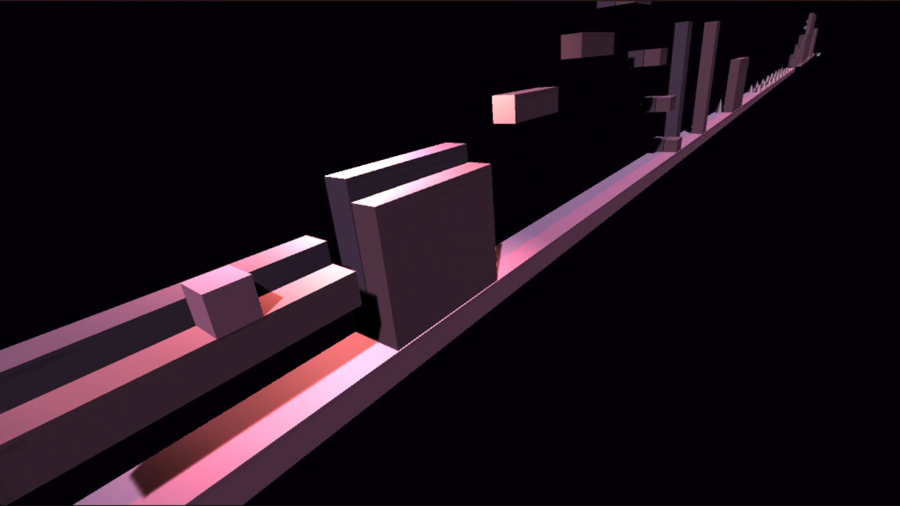
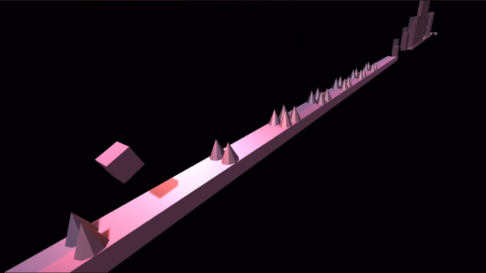
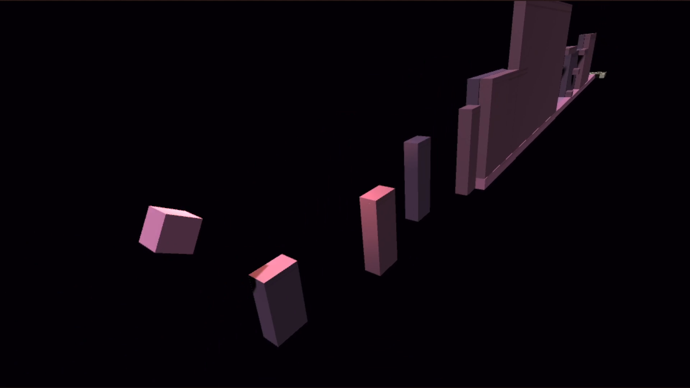
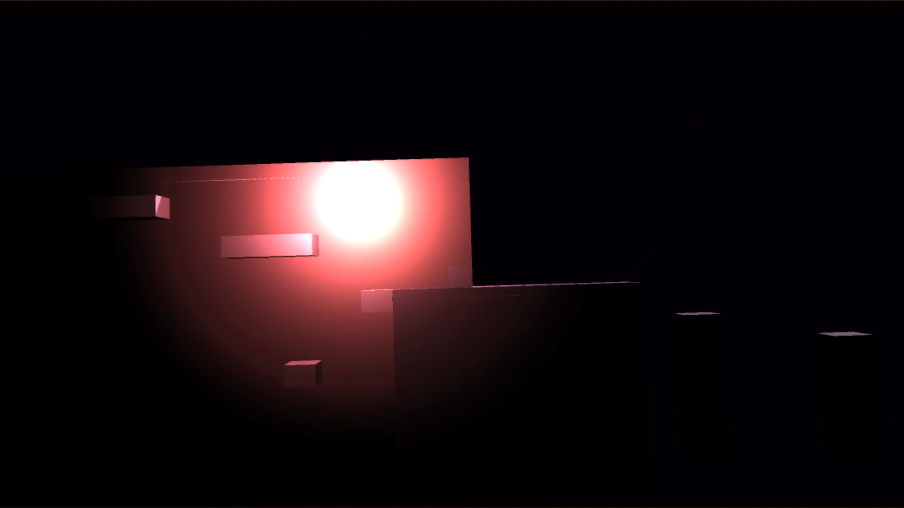
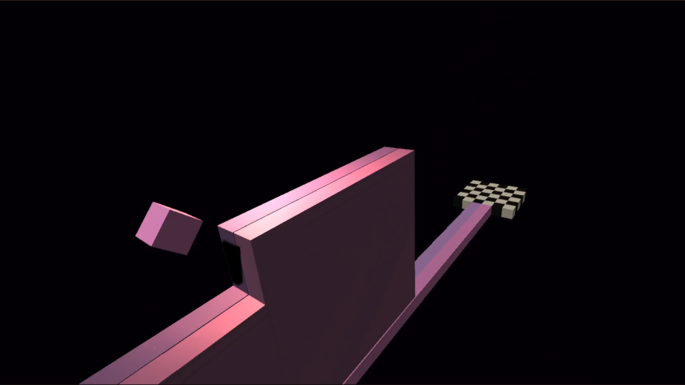

<h1 align="center">The Dashing Cube Game</h1>

Video here: https://www.youtube.com/watch?v=LKj0A5WA658

<h2>What is this about?</h2>

This little project was my first try at coding a game in Unity. I tried to make a 3D implementation of the famuos game Geometry Dash. Here, besides is 3D, the cube has 2 paths to complete the level.

  
  
  
  
  

